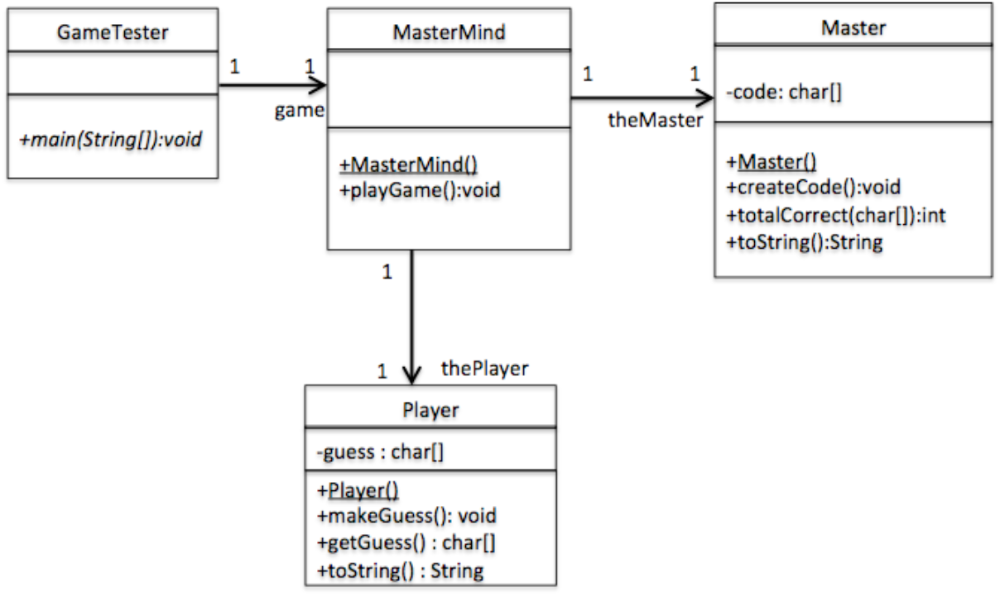
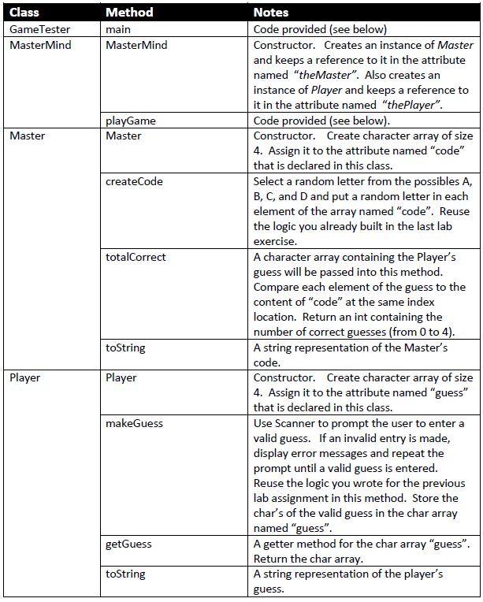

# lab-6

## Object Oriented MasterMind

Create an object oriented version of the AlphaCodeBreaker game from your previous lab.
Use the model below and follow the 8 step process taught in class.
A description of each of the methods is provided as well as some Java code for two of these methods.



Method Summary:



Contents of GameTester main method:

```java
  public static void main(String[] args) {
    MasterMind m = new MasterMind();
    m.playGame();
  }
```

Contents of MasterMind playGame method:

```java
  public void playGame() {
    System.out.println("WELCOME TO CODEBREAKER...Let's Play!\n");
    System.out.println("Guess a 4-letter code with letters A, B, C, and D\n");

    theMaster.createCode();

    while (true) {
      thePlayer.makeGuess();
      int x = theMaster.totalCorrect(thePlayer.getGuess());
      if (x == 4) {
        System.out.println("\nGOT IT!!\n");
        break;
      } else
        System.out.printf("MISSED! GOT %d out of 4.  PLEASE TRY AGAIN...\n", x);
    }
  }
```

Sample Run

```
WELCOME TO CODEBREAKER...Let's Play!

Guess a 4-letter code with letters A, B, C, and D

YOUR GUESS=> AAAA
MISSED! GOT 3 out of 4.  PLEASE TRY AGAIN...
YOUR GUESS=> AAAB
MISSED! GOT 2 out of 4.  PLEASE TRY AGAIN...
YOUR GUESS=> AABA

GOT IT!!
```

---

## Compile and Run

### GameTester

    javac GameTester.java
    java GameTester
