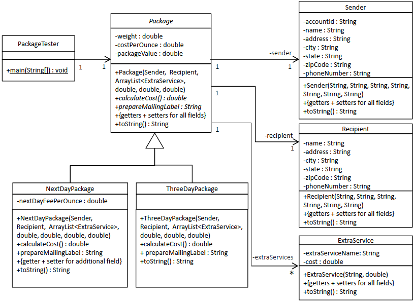

# lab-7

## Package Delivery Service

Package-delivery services (e.g. FedEx, DHL, UPS, USPS) offer a number of different shipping options.
Each option has delivery specifications (e.g. next day, 3-day) and associated costs.
There are also extra service options (e.g. insurance, delivery confirmation) to manage the delivery.

We will be creating an inheritance hierarchy to represent various types of packages and their extra services.
Class _Package_ will be the abstract (italicized) base class for the various types of packages.
The classes **NextDayPackage** and **ThreeDayPackage** will be two derived types of packages that inherit the functionality of the base _Package_ and extend it to effectively cost its service.

Each Package will have a Sender, Recipient, and list of ExtraService objects.
Use the model below.
A description of each of the methods is provided.



**Note**: we have taken the liberty to request getters/setters for all attributes.
It is recommended that you use Eclipse’s facility to generate these.

PackageTester's main method:

```java
  public static void main(String[] args) {
    ExtraService deliveryConfirmation = new ExtraService("Delivery Confirmation", 0.75);
    ExtraService signatureConfirmation = new ExtraService("Signature Confirmation", 1.35);
    ArrayList<ExtraService> extraServices = new ArrayList<ExtraService>();
    extraServices.add(deliveryConfirmation);
    extraServices.add(signatureConfirmation);

    Sender theSender = new Sender("12345678912345", "Lou Brown", "1 Main Street", "Boston", "MA", "02102",
        "617-123-4567");
    Recipient theRecipient = new Recipient("Mary Smith", "7 Elm St", "New York", "NY", "10453", "212-111-1111");
    double theWeight = 8.5;
    double theCostPerOunce = .50;
    double theNextDayFeePerOunce = .25;
    double thePackageValue = 1000.0;

    Package theNextDayPackage = new NextDayPackage(theSender, theRecipient, extraServices, theWeight, theCostPerOunce,
        theNextDayFeePerOunce, thePackageValue);
    System.out.println(theNextDayPackage.prepareMailingLabel());
    System.out.printf("\nCost = %.2f\n\n", theNextDayPackage.calculateCost());

    Package theThreeDayPackage = new ThreeDayPackage(theSender, theRecipient, extraServices, theWeight, theCostPerOunce,
        thePackageValue);
    System.out.println(theThreeDayPackage.prepareMailingLabel());
    System.out.printf("\nCost = %.2f\n\n", theThreeDayPackage.calculateCost());

  }
```

Sample Run

```
Next Day Package

  From:
    Lou Brown
    1 Main Street
    Boston, MA  02102

  To:
    Mary Smith
    7 Elm St
    New York, NY  10453


Cost = 8.48

3-Day Package

  From:
    Lou Brown
    1 Main Street
    Boston, MA  02102

  To:
    Mary Smith
    7 Elm St
    New York, NY  10453


Cost = 6.35
```

---

## Compile and Run

### PackageTester

    javac PackageTester.java
    java PackageTester
