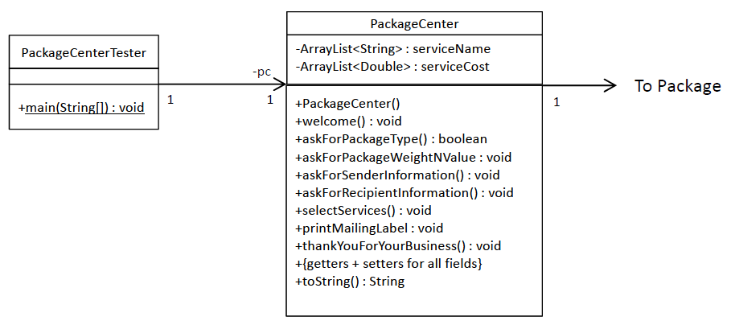
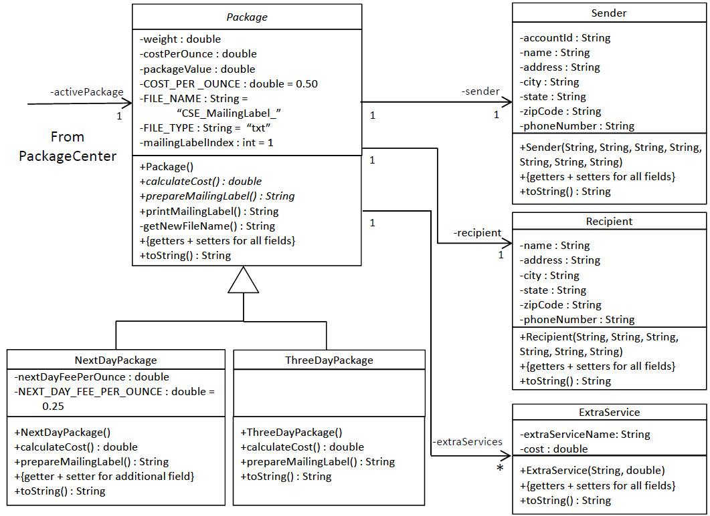

# lab-8

## Package Center Prototype

The Package Center Prototype will use the Package Delivery Services to take the customer interactively through the process of asking for the:

1. Type of package.
2. Package’s weight and value.
3. Sender’s information.
4. Recipient's information.
5. Selecting a single extra service.
6. Printing a mailing label to a file.

We will be adding the class `PackageCenter` to manage the interactive console based process.
Some of the classes from the Package Delivery Services effort will need some additions and modifications.
Use the attached model. A description of each of the methods is provided.





**Note**: we have taken the liberty to request getters/setters for all attributes. It is recommended that you use Eclipse’s facility to
generate these.

Contents of `PackageCenterTester` main method:

```java
  public static void main(String[] args) {

    PackageCenter pc = new PackageCenter();

    pc.welcome();

    while (pc.askForPackageType()) {
      pc.askForPackageWeightNValue();
      pc.askForSenderInformation();
      pc.askForRecipientInformation();
      pc.selectServices();
      pc.printMailingLabel();
    }

    pc.thankYouForYourBusiness();
  }
```

Sample Run

```
Welcome to CSE Package Center

Select Package Type:
  1. Next Day Package
  2. 3-Day Package
  3. Shutdown/Exit Processing
1

Enter Package Weight/Value:
  Weight: 8.5

  Value: 1000

Enter Sender Information:

  Account Id : 12345678912345

  Name : Lou Brown

  Address: 1 Main Street

  City: Boston

  State: MA

  Zip Code: 02102

  Phone Number: 617-123-4567

Enter Recipient Information:

  Name : Mary Smit

  Address: 7 Elm St

  City: New York

  State: NY

  Zip Code: 10453

  Phone Number: 212-111-1111

Select Services:
  1. Delivery Confirmation - $0.75
  2. Signature Confirmation - $1.35
1

Package Cost =  7.13


Select Package Type:
  1. Next Day Package
  2. 3-Day Package
  3. Shutdown/Exit Processing
3


Thank You For Your Business
```

---

## Compile and Run

### PackageCenterTester

    javac PackageCenterTester.java
    java PackageCenterTester
