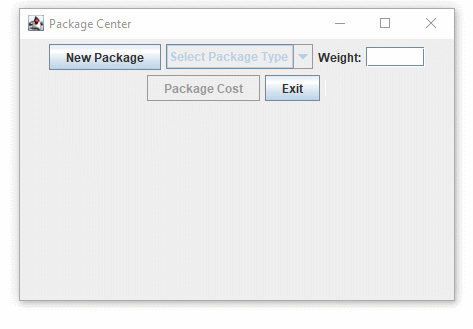

# lab-9

## Package Center UI

The immediate task for this GUI is to calculate a package's cost given its weight.
You can expand on this by exploring/experimenting/... with new concepts.
To encourage this we will be awarding Extra Credit (reference Extra Credit section for details) for enhancements to the base solution.

Build the components, layout managers, event handlers (i.e. listeners) and inner classes need for the basic Package Center UI called `PackageCenterUI`.
You will be using the classes from your previous efforts Package Delivery Services (lab-7) and Package Center (lab-8) to provide functionality as needed for the listeners.
To simplify your effort – use a FlowLayout Manager and arrange (i.e. add) the components sequentially.

The components for this UI include:

1. **New Package** button – starts the process. Its event handler (`NewPackageButtonHandler` inner class) will initialize fields and put the "New Package Requested" message in the Message Text Area.
2. **Select Package Type** combo box – selects the type of package. Its event handler (`PackageTypeComboBoxHandler` inner class) will initialize fields and put the "New Package Requested" message in the Message Text Area. The combo box’s values to select are:
   a) **Select Package Type** – initial value. If selected then the "No Package Type Select" is specified in the Message Text Area.
   b) **Next Day Package** – creates a NextDayPackage object and makes it available (e.g. private Package activePackage;). "Next Day Package Selected" is specified in the Message Text Area. The **Package Cost** button is enabled. The **New Package** button is disabled.
   c) **3-Day Package** – creates a ThreeDayPackage object and makes it available (e.g. private Package activePackage;). "3-Day Package Selected" is specified in the Message Text Area. The **Package Cost** button is enabled. The **New Package** button is disabled.
3. **Weight** label – label with "Weight:" value.
4. **Weight** text field – text field for entering a package’s weight value.
5. **Package Cost** button – costs the package. Its event handler (`PackageCostButtonHandler` inner class) will get the entered value from the Weigh text field. It uses the package object’s calculateCost method to determine the package’s cost. It places this cost information in the Message Text Area.
6. **Exit** button – exits the application. Its event handler (ExitButtonHandler inner class) will issue a System.exit(0) to exit the application.
7. **Message Text Area** – a text area for displaying information messages.

Sample Run

---

## Compile and Run

### PackageCenterUITester

    javac PackageCenterUITester.java
    java PackageCenterUITester
